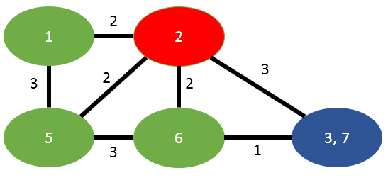

Welcome back to my first actual blogging topic of 2020, yes - I'm late and even though I have a huge backlog of video games waiting for me, I'm still spending some time to write this post because I struggled a lot to find good resources for this algorithm.

Today is about computing the [Minimum Cut](https://en.wikipedia.org/wiki/Minimum_cut) of a graph using the [Stoer–Wagner algorithm](https://en.wikipedia.org/wiki/Stoer%E2%80%93Wagner_algorithm). I largely follow the [original paper published by Mechthild Stoer and Frank Wagner](https://refubium.fu-berlin.de/bitstream/handle/fub188/18688/1994_12.pdf?sequence=1&isAllowed=y) and add fancy looking pictures and explain it along with some Java code.

A full implementation of the [Stoer-Wagner algorithm](https://github.com/thomasjungblut/tjungblut-graph/blob/master/src/de/jungblut/graph/partition/StoerWagnerMinCut.java) can be found in my [graph library](https://github.com/thomasjungblut/tjungblut-graph).

## What are Minimum Cuts?

A Minimum Cut is a a way to partition a (weighted) graph into two disjoint graphs (a "cut") so that the edges connecting these two graphs are of minimal weight in summation.

According to the official definition in the paper, a Mincut is:

>  ... a nontrivial partition of the graph's vertex set V into two parts such that the sum of the weights of the edges connecting the two parts is minimum

An example mincut of the graph mentioned in the paper can be seen here:


You see the two disjoint subgraphs, green on the left and orange on the right. The edges in red are the edges "on the cut", meaning those are the ones that separate the two subgraphs. This graph has the mincut weight of 4, since the sum of the edge weights on the cut is exactly that (3+1).

## What are some real-life applications for it?

The paper gives a nice introduction to it:

> Graph connectivity is one of the classical subjects in graph theory, and has many practical applications, e.g. in chip and circuit design, reliability of communication networks, transportation planning and cluster analysis. 

Before deep learning became good at it, it was used in image segmentation along with spectral clustering and it's being used in detecting bottlenecks in any kind of flow networks.

As a real-life example, think of a transportation network that connects two cities and they are only connected via two fairly narrow roads - like our example graph above. A min-cut could partition the (transportation) graph into the two disjoint subsets (cities) and detect the narrow roads as the edges that separate them according to some weighting schema (eg. the narrowness of the road or the speed limit on such a road).

## The intuition of the algorithm

We'll dive into the exact algorithm below, but I wanted to give a bit of insight on how this algorithm works. The crucial observation that is behind the algorithm is very similar to [Prims algorithm](https://en.wikipedia.org/wiki/Prim%27s_algorithm), which is finding the Minimum Spanning Tree (MST).  Prim works by starting at any vertex, always adding the next minimal edge in the graph until all vertices are connected. 

Stoer-Wagner is basically the same in reverse: we're taking the full graph and starting at any vertex and doing a `maximum adjacency search` which results in finding two vertices `s` and `t`. Those are the last two vertices we found during the search - don't worry we'll explain the search in detail below.  
`s` and `t` are then merged into one vertex, effectively `t` will be removed from the graph and its edges will then transfer to `s` (summing the weights in case both pointed to the same vertex). `t` is kept as part of our first partition and we keep track of the `cut weight` of `t`.

Now doing this dance recursively, we find ourself growing our partition (all the `t`'s gathered so far) and a shrinking graph (as we're constantly removing `t`'s). Inevitably we end up with a graph that only has two vertices and this is where we stop the algorithm. While we're doing this, we keep track of the partitions that had the smallest `cut weight` so far. This smallest `cut weight` set of `t`'s at the end is our first partition and the remainder of the vertices in that graph is our second partition. 

Voilá, you cut the graph in half with minimal weights between. 

## The formal algorithm

Formally the paper defines a `MinimumCutPhase` and a function `MinimumCut` that makes use of the former.

The `MinimumCutPhase` (aka "Maximum Adjacency Search") looks like this in pseudo code, given a Graph `G` and a starting node `a`.

```
MinimumCutPhase(G, a):
  A <- {a}
  while A != V:
    add to A the most tightly connected vertex
  return s, t, and the cut weight as the "cut of the phase"
```

As described earlier, we're constantly adding the vertices to the set that are the most `tightly connected` (our `s` and `t`, found by `Maximum Adjacency Search`). 

Then to wrap it up, we define `MinimumCut` of the Graph `G` as:

```
MinimumCut(G):
  minimum cut = nil
  while |V| > 1:
    choose any a from V
    cut of the phase = MinimumCutPhase(G, a)
    if the "cut of the phase" cut is lighter than the current minimum cut:
      minimum cut = cut of the phase
    shrink G by merging the two vertices from the "cut of the phase" (s, t)
  return the minimum cut
```

Each `MinimumCutPhase` will shrink our graph and stores the best cuts we have seen so far, always merging `s` and `t` from our `cut of the phase` as we go along. This works on graphs with positive weights and always needs at least connected two vertices, otherwise we couldn't partition it into two.

Note: the definitions are simplified and hopefully a bit clearer compared to the ones found in the paper.

## Maximum Adjacency Search

Now as we figured, the most central part of the algorithm is the `Maximum Adjacency Search`. Despite it being described in literature with different names all the time, there is a [good C++ implementation with academic references in Boost](https://www.boost.org/doc/libs/1_66_0/libs/graph/doc/maximum_adjacency_search.html).

The intuition is that we want to traverse the graph in order of its maximum weight towards the set of vertices we have found so far - let's call it the `foundSet`. The `foundSet` at the beginning is initialized with any vertex in that graph. In the remainder of the graph we proceed to search for the next vertex, which has the largest sum of weights towards the `foundSet`.  

This vertex is then removed from the graph and added to the `foundSet`. This goes on until there are no more vertices in that graph to search. The order in which the vertices are added in that `foundSet` is important, as the last two vertices are our `s` and `t` and the last sum will be the `cut weight` of the respective `cut of the phase`.

Let's dive into some code to clarify, given a simple graph interface that gives us the following methods:

```java

interface Graph {   
    // the unique identifiers of the vertices in that graph
    Set<String> getVertexIDSet();
    // returns the edge between a source vertex ID and a destination ID.
    // Edge includes the weights, returns null if there is no edge
    Edge getEdge(String source, String destination);
    // used later, but just a nicer way to put 'getVertexIDSet().size()'
    int getNumVertices();
}

```

The algorithm in Java looks like this:

```java
CutOfThePhase maximumAdjacencySearch(Graph g) {
    String start = g.getVertexIDSet().iterator().next();
    List<String> foundSet = new ArrayList<>(Collections.singletonList(start));
    List<Integer> cutWeight = new ArrayList<>();
    Set<String> candidates = new HashSet<>(g.getVertexIDSet());
    candidates.remove(start);

    while (!candidates.isEmpty()) {
        String maxNextVertex = null;
        int maxWeight = Integer.MIN_VALUE;
        for (String next : candidates) {
            int weightSum = 0;
            for (String s : foundSet) {
                Edge edge = g.getEdge(next, s);
                if (edge != null) {
                    weightSum += edge.getWeight();
                }
            }

            if (weightSum > maxWeight) {
                maxNextVertex = next;
                maxWeight = weightSum;
            }
        }

        candidates.remove(maxNextVertex);
        foundSet.add(maxNextVertex);
        cutWeight.add(maxWeight);
    }

    // we take the last two vertices in foundSet and their weight as a cut of the phase
    int n = foundSet.size();
    return new CutOfThePhase(
            // that's "s" in the literature and will remain as a merged vertex with "t"
            foundSet.get(n - 2), 
            // that's "t" and will be removed afterwards
            foundSet.get(n - 1), 
            // that's "w" to compute the minimum cut on later
            cutWeight.get(cutWeight.size() - 1)); 
}

```

If you read it, you may find it very similar to Depth-First-Search (DFS) - but instead of taking any vertex as the next step, we find the one that has the largest incoming edge weights to our already traversed vertices. This also reminds of Prims algorithm again, which greedily picks the next edge to construct the MST.

> ⚠️ Premature Optimization Warning

In Java you might want to optimize this O(n^2) search loop with a `java.util.PriorityQueue` and I've seen several implementation on the internet doing it. While correct and possible, in reality this requires you to remove and add the element again (which is a linear search to remove and a heap addition, so O(n) + O(log n) = O(n)), which is considerably slower than just a traditional `down-heap` operation and even slower than a linear search. Please use a specifically constructed Heap that implements this behaviour - for example [org.apache.hadoop.util.PriorityQueue](https://github.com/apache/hadoop/blob/a55d6bba71c81c1c4e9d8cd11f55c78f10a548b0/hadoop-common-project/hadoop-common/src/main/java/org/apache/hadoop/util/PriorityQueue.java) with its `adjustTop` method (which I believe originated in Apache Lucene).

---

If you were to run this algorithm, starting with vertex `2` in red:


You will visit the vertices in that order: 

> 2, 3, 4, 7, 8, 6, 5 (becomes s), 1 (becomes t)

and the cut weight of 5, as the summation of 2 (coming from vertex 2) plus 3 (coming from vertex 5).  
So as the result we return `s=5`, `t=1` and the cut-weight as `5`.

Now let's go one level higher to tie this into the actual `MinCut` algorithm.

## Finding the MinCut

We can now use the Maximum Adjacency Search to compute the `MinCut`, here again with Java and our Graph interface:

```java
Set<String> currentPartition = new HashSet<>();
Set<String> currentBestPartition = null;
CutOfThePhase currentBestCut = null;
while (g.getNumVertices() > 1) {
    CutOfThePhase cutOfThePhase = maximumAdjacencySearch(g);
    if (currentBestCut == null || cutOfThePhase.weight < currentBestCut.weight) {
        currentBestCut = cutOfThePhase;
        currentBestPartition = new HashSet<>(currentPartition);
        currentBestPartition.add(cutOfThePhase.t);
    }
    currentPartition.add(cutOfThePhase.t);
    // merge s and t and their edges together
    g = mergeVerticesFromCut(g, cutOfThePhase);
}

// currentBestPartition now contains our first partition.
```

Similar to the pseudo-code, we try to find the best `cut of the phase` and merge the graph until it only contains two vertices.

As you can see, `mergeVerticesFromCut` is not defined and I leave it up to you to implement as homework. I want to leave a couple of pictures from the paper however as they explain pretty well what needs to be done. Let's take the output from the Maximum Adjacency Search above:


Now the algorithm states, we have to merge `t` into `s`. The result looks like this:


We have one edge in common between `s` and `t`, that is (5,2) and that will inherit the summation of weights (2+2=4). The edge between `s` and `t` is dropped. 

The other case is when an edge has to be transferred (as there is no other to sum it with), below to images illustrate this behaviour:


Here we have to merge 3 into 7, that means that the edge (3,2) need to be transferred to the former vertex 7:



Again the edge between `s` and `t` is dropped.  
That is everything you need to pay attention to when implementing such merge.

## Reconstructing the graphs

If you followed the above implementation closely, the set of vertex identifiers in our first partition is not really an interesting result. Ideally the result should be two new disjoint graphs (the partitions) and the actual edges that were on the cut of the graph, including their weight.

Given the original graph, the best cut of the phase and the first partition, we can construct a meaningful result in not-quite-Java:

```java

public class MinCutResult {
    private final Graph first;
    private final Graph second;
    private final List<Edge> edgesOnTheCut;
}

public MinCutResult constructMinCutResult(Graph originalGraph,
                                Set<String> partition,
                                CutOfThePhase bestCut) {

    Graph first = new Graph();
    Graph second = new Graph();
    List<Edge> cuttingEdges = new ArrayList<>();
    int cutWeight = 0;
    
    for (String v : originalGraph.getVertexIDSet()) {
        if (partition.contains(v)) {
            first.addVertex(new Vertex(v));
        } else {
            second.addVertex(new Vertex(v));
        }
    }    

    for (Edge e : originalGraph.getEdges()) {
        if (first.contains(e.source) && first.contains(e.destination)) {
            first.addEdge(new Edge(e.source, e.destination e.weight));
        } else if (second.contains(e.source) && second.contains(e.destination)) {
            second.addEdge(new Edge(e.source, e.destination, e.weight)));
        } else {
            cuttingEdges.add(new Edge(e.source, e.destination, e.weight))
            cutWeight += weight;
        }
    }

    return new MinCut(first, second, cuttingEdges, cutWeight);
}

``` 

It works in two steps:

1. iterating over the set of vertices in the original graph: partition into the two subgraphs by checking what vertices our algorithm assigned to the first partition. If a vertex is not part of that partition, it must be in the second subgraph.
2. iterating over the set of edges in the original graph: if both source and destination vertex are both in a graph, add it to the respective graph. Otherwise it must be an edge on the cut.

And that's it!

## Full Code

As already stated in the beginning, the full implementation of the [Stoer-Wagner algorithm](https://github.com/thomasjungblut/tjungblut-graph/blob/master/src/de/jungblut/graph/partition/StoerWagnerMinCut.java) can be found in my [graph library](https://github.com/thomasjungblut/tjungblut-graph).

Don't be scared by the generics, it's fairly simple if you can just drag it back into strings and integers. As always, a good start are [the test cases](https://github.com/thomasjungblut/tjungblut-graph/blob/master/test/de/jungblut/graph/partition/StoerWagnerMinCutTest.java). Otherwise feel free to reach out to me, I'm happy to help if you have any questions.
