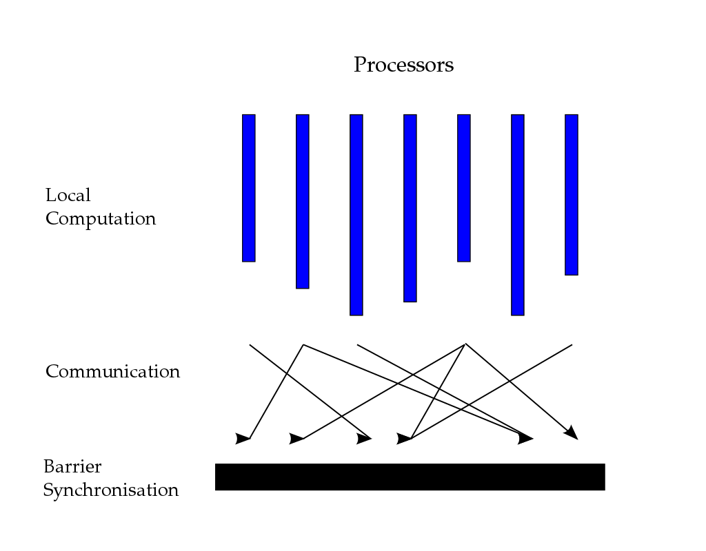
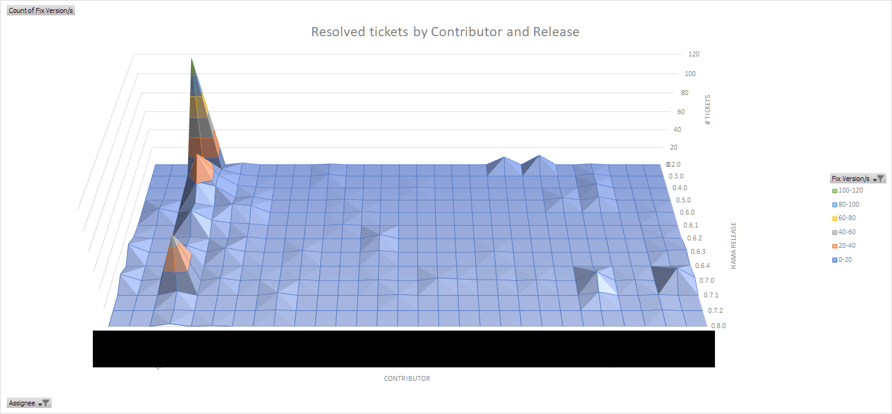
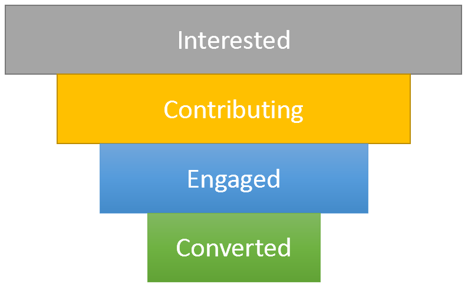

Apache Hama moved in April 2020 to the [Apache Attic](https://attic.apache.org/projects/hama.html), which is the final resting place for Apache projects that reached their end of life. Today, roughly half a year after this move, I think it is a good time to write a blog post about why we think this happened.

When you're asking yourself who "we" is, this is a joint post with Edward J. Yoon (the original creator of Hama and long time Project Champion and PMC Chair), Chia-Hung Lin (PMC chair, committer and PMC member) and myself (past time committer and PMC member). Helpful input and comments were given by Tommaso Teofili (our Apache mentor and PMC member) - **thank you all!**

An important goal for this post is that we want to help other Apache projects, especially in the incubator, that have their whole lifetime ahead of them and give them the opportunity to learn from our humble mistakes in running this project for over a decade.


# Table of Contents
```toc
exclude: Table of Contents
```

# History

([this is partially based on a micro blog Edward wrote in Korean](https://brunch.co.kr/@edwardjyoon/23))

## Early Days

Edward in 2007 was a very famous blogger for a couple of Google papers that came out around that time. Namely: [BigTable](https://research.google/pubs/pub27898/), [MapReduce](https://research.google/pubs/pub33004/) and [Google FileSystem (GFS)](https://research.google/pubs/pub51/). Those were the academic and technical foundations of what eventually became the [Big Data hype that hit us around 2010](https://trends.google.com/trends/explore?date=all&geo=US&q=big%20data) with full broadside. [Apache Hadoop](https://hadoop.apache.org/) here was a front-runner originally contributed from Yahoo! and spawned numerous applications in the Apache ecosystem that were centered around MapReduce and HDFS (the Hadoop Distributed FileSystem). 

Apache Hama was originally created as a matrix multiplication library on top of Hadoop and MapReduce, which is also where it got its name from (Hadoop Matrix). When you implement matrix multiplications with MapReduce, for example as part of graph algorithms like PageRank, you will find yourself using a pattern called [message passing](https://en.wikipedia.org/wiki/Message_passing). You are usually passing messages along with the original data as part of the map step and in the reduce step have all messages available for a given data point. This allows you to merge and interpret these messages and prepare for the next iteration. 

> I used to blog a lot about these kinds of [recursions](https://blog.thomasjungblut.com/blogger/controlling-hadoop-job-recursion/), [MinDist Search in a Graph](https://blog.thomasjungblut.com/blogger/graph-exploration-with-hadoop-mapreduce/) and there has been an [excellent whitepaper on the whole topic by Jimmy Lin and Michael Schatz](http://users.umiacs.umd.edu/~jimmylin/publications/Lin_Schatz_MLG2010.pdf) if you want to read more about it.

The whole pattern not only sounds abusive: it is very inefficient as the same data has to be constantly read from disk or network, along with small payloads written to HDFS and shuffled and joined for the reduce phase - across the network - all over and over again. It made sense to skip all that mapping and reducing and directly go with a message passing protocol. The choice then fell on [Bulk Synchronous Parallel](https://en.wikipedia.org/wiki/Bulk_synchronous_parallel) (BSP), which originated in the 80s from Leslie Valiant and has a fairly famous academic library called BSPlib. 

## What is BSP?

It's best explained by looking at the below picture:



It's conceptually simple and formalized in three discrete steps: 
1. **Computation**: each of the parallel processors runs local computations 
2. **Communication**: exchange messages with other processors
3. **Barrier Synchronization**: make sure all processors came to that stage and received the messages from other processors

Iterative algorithms would make use of these steps by continuously running them until some kind of convergence has been achieved. For example in PageRank that would be a small enough delta per iteration of the individual PageRanks or a limit on the number of iterations.

> If that looks similar to what [MPI]((https://en.wikipedia.org/wiki/Message_Passing_Interface)) (message passing interface) does, yes it's a very very simplistic version of what MPI can do.

Fun fact: you can even express MapReduce using BSP. The map phase is exactly what the local computation is, shuffle and joining is the communication and synchronization phase and another following local computation would be the reduce phase.

## Important Events and Contributions

Back to the actual history of Apache Hama, the pivot from MapReduce library to BSP was done sometime in 2009/2010 if I remember correctly. We've been developing together for a couple of releases and eventually graduated the Apache Incubator in July 2012 where we had our first release 0.5.0 as Apache Hama - a fully fledged Top Level Project (TLP).

Couple of my personal important milestones with Hama, as they are useful context for the below sections as well:
* 2011 was the first year Hama participated in [Google Summer of Code](https://cwiki.apache.org/confluence/display/hama/GSoC2011) (GSoC), which helped students to work on interesting open source projects for a bit of money and swag. This is how I found my way to contribute to Hama.
* 2011 also had release 0.3.0 which contained the first couple of Graph algorithms ([Pagerank](https://issues.apache.org/jira/browse/HAMA-395), [Single Source Shortest Path Finding](https://issues.apache.org/jira/browse/HAMA-359)) - we'll touch upon these later when we discuss technical shortcomings
* 2012 with its 0.4.0 release added a [Hadoop-like data IO system](https://issues.apache.org/jira/browse/HAMA-258)
* later in 2012 we released 0.5.0 with the [new Pregel-like Graph Computation API](https://issues.apache.org/jira/browse/HAMA-409) and another interesting graph algorithm [Bipartite Graph Matching](https://issues.apache.org/jira/browse/HAMA-550)
* until 2014 the 0.6.x releases then added a fully fledged [math and machine learning library](https://issues.apache.org/jira/browse/HAMA-604), [neural networks](https://issues.apache.org/jira/browse/HAMA-804), [k-means](https://issues.apache.org/jira/browse/HAMA-547), [cross-language "streaming" adapters](https://issues.apache.org/jira/browse/HAMA-601) - [also "pipes" for c++](https://issues.apache.org/jira/browse/HAMA-619), [Sparse Matrix-Vector Multiplication](https://issues.apache.org/jira/browse/HAMA-524). I also believe we added [Hadoop YARN support during this time](https://issues.apache.org/jira/browse/HAMA-431), which we were the very first to actually implement in the whole Apache ecosystem.
* in 2015-2018 the 0.7.x releases featured [more efficient in-memory storage of serialized messages](https://issues.apache.org/jira/browse/HAMA-783), [collaborative filtering for recommender systems](https://issues.apache.org/jira/browse/HAMA-612), [Mesos Runtime](https://issues.apache.org/jira/browse/HAMA-726) and many more things.

More than a decade after it started and "Big Data" being [largely co-notated negatively in public](https://www.nytimes.com/2020/01/15/technology/data-privacy-law-access.html), [Hortonworks and Cloudera merging companies](https://www.cloudera.com/about/news-and-blogs/press-releases/2019-01-03-cloudera-and-hortonworks-complete-planned-merger.html) and the later hype in Machine Learning slowing down again -  Apache Hama was invited to join the Attic in April 2020.

Retrospectively looking at all the things the team behind Apache Hama has shipped, I can only say that I'm still very proud having been part of this team. Yet the world around Apache Hama moved even faster than we could as a community.

# Community

One very great thing about Apache projects is that they are fully driven by their community as a meritocracy. Basically everything is being voted on and it is open for anybody to join the mailing lists, comment and vote. Building a community around your project is your only way to survive and is also an important checkpoint when the project graduates from the incubator. The Apache Foundation takes a very close look at whether your project is entirely driven by a company, that might defund the project or move the people working on it, or whether you've built a thriving community of individuals that are contributing frequently to releases.

Another good thing about Apache projects is that we can look at the JIRA project (I can't believe I'm saying this in 2020) and get the individual contributions over time and per release: 



On the Z-axis coming vertically up are the amount of tickets a contributor (X-axis, each line one person) has resolved as the assignee and on the Y-axis we have the releases ascending towards the bottom. Of course, not every resolved ticket is the same and solving a lot of small tickets is not the same as contributing few high quality patches - however it gives a very good indicator for project engagement.  
As you can see from the data, this project was mostly driven by one person over the whole time and other contributors only added a few patches and sometimes only for one or two consecutive releases. 

> Constantly analyse the contributions and the contributors and make sure they are happy and engaged with your project. It's healthier to have many contributors than very few super-active ones. You might already know this as the [bus factor](https://en.wikipedia.org/wiki/Bus_factor).

You can also argue that Hama was a very scientific project that primarily attracted students and, matter of fact, we got a lot of attention by consistently having a really exciting set of GSoC projects available. GSoC is really helpful because you gain fresh contributors that usually start by taking on a couple newbie issues and improving documentation while they ramp up on the project. This is a helpful multiplier for other people that want to contribute by constantly smoothing the onboarding experience. On the flipside, students are only students for so long and very few stay for longer than the GSoC period. 

> Diversify the community by attracting a healthy mix of spare-time contributors, academics, students and, if possible, fulltime employees that are being paid to contribute.

Which of course brings up the question: how do you attract these people? Outside of GSoC we found meetups and conferences to be quite important. Whenever there is a chance for you to present it - take it! However, this is only the very start of building a community. Bringing people in by the metric ton does not actually keep you afloat. You need a way to keep them happy and engaged with your project for a longer period of time. The Apache way of working helps, as it gives you a strong recommendation of involving your community for everything (from roadmaps to releases). Maybe it is an overkill for some, but I usually like to visualize this with a classic conversion funnel that you may know from SaaS: 



From this model you can figure out quickly how your community is currently looking like and how "strong" it stays over time. The way you shape each individual step in the funnel is up to you and certainly depends on your community. The goal is not to annoy them to contribute for engagement's sake, but rather to figure out where people are stuck and what to do about it: 

* Do you have trouble getting people interested and into the funnel? 
  * Invest more time into going to meetups, presenting things and acquiring people and companies that could be interested in the project.

* Do you struggle to get people into the "Contributing" step? 
  * This is a clear sign that people can't pick up easy tasks for starting: invest time to scope out starter exercises and invest into your documentation for people to ramp up.
  * For Hama working on small examples was very helpful, as it gave contributors familiarity with the framework and more usecases for others to come into the funnel eventually.

* Do you have trouble keeping people around for multiple releases ("Engaged")?
  * The ASF gives you a nice carrot here: the PMC (project management committee) can vote contributors into the "[committer](http://community.apache.org/contributors/)" status. This comes with perks like write/merge permissions to the project and your own apache.org e-mail address. Of course after some time you can also ask them to join the PMC itself (by having a vote).
  * When time and pandemics allow for it, make sure you organize get-togethers. It really helps with bonding. When you enjoy working with people you know personally, it's easier to retain them working for the project.

"Converted" is up for you to define by what you want to get out of the community in the long run. Maybe you want to grow your PMC members into becoming chairs or project champions eventually. There is still plenty of room to grow in the framework of the ASF.

# Technical Shortfalls

Since we're primarily building a framework, we inevitably also had some shortfalls in our technology. Here's my top three that significantly hindered Hama's adoption:

## Installation Challenges

Hama required a totally new set of daemons to be installed, back then this was a big deal. There was no Docker and Kubernetes to just spin up a couple of containers: somebody had to go and install the release on hundreds of Linux servers. It worked with HDFS, but there was no reuse of the existing Hadoop TaskManagers. Eventually you had to run them side-by-side with MapReduce (which is bad for resource sharing reasons) or create a new cluster for it (expensive). Projects like [Giraph](https://giraph.apache.org/) figured that out early and directly ran on top of Mappers, "abusing" the MapReduce framework as a JVM scheduler. As a result Giraph had much better community and industry adoption.

## Scalability Challenges

Due to the [gang-scheduling](https://en.wikipedia.org/wiki/Gang_scheduling) aspect of always running all BSP peers at the same time, we had a lot of trouble fitting peers into a cluster. When your matrix/graph was too big or you didn't have enough memory, it would just not run. A lot of folks were coming from the expectations of MapReduce, which can run on a few servers and if you want to wait less, you can just add more servers. Talking about not having enough memory, the framework was a real hog of that. All messages you were sending were stored in memory, all data you needed to load to do computations most likely also was stored in memory. Of course with Spark coming up and RAM becoming cheap, this was less of an issue, but companies were building out new clusters with Spark - not with Hama. 

## Difficult Programming Model

While BSP is not quite like MPI in terms of complexity, the programming model was too difficult for people to build applications on top of it. We also frequently found ourselves building MPI primitives like [All-Reduce](https://mpitutorial.com/tutorials/mpi-reduce-and-allreduce/) in BSP for every algorithm that required it. It's a very common thing in [machine learning](https://tech.preferred.jp/en/blog/technologies-behind-distributed-deep-learning-allreduce/) and graph algorithms to reduce the state of all workers and distribute it back. In BSP this is a costly operation: you have to send all state to one single machine, sync, compute on that one machine (while all others are IDLE), send the result back to all workers and sync again. 

This inherent inefficiency of the programming model, earlier lack of an IO system and us not explicitly focusing on a vertical (like Giraph with Graphs) caused a lot of problems: **BSP is too generic for people to "get it"**. Eventually we added a graph module and an IO system, but then Spark came around with full force. With its more sophisticated model based on RDDs and higher level functions (not just map and reduce), people from functional programming immediately felt at home and could suddenly write clustered software that scales with a few lines. Of course a graph and math package was very easy to build over such solid abstractions and I think that was the effective nail in the coffin for Hama.

# From an Apache Contributor and User perspective

This section was fully authored and kindly contributed by **Chia-Hung Lin** - thank you.

## The Level of Contribution

The Apache Software Foundation (The ASF) is a non-profit [public charity organization](https://www.apache.org/foundation/how-it-works.html). After signing [ICLA](https://infra.apache.org/new-committers-guide.html#becoming-a-committer) and the acceptance of ICLA by the ASF, one becomes a committer and further may be invited as the member of [PMC](https://www.apache.org/foundation/governance/pmcs.html). 

## Decentralized Community

The ASF is a decentralized open source [community of developers](https://en.wikipedia.org/wiki/The_Apache_Software_Foundation), and because of its nature, most of its activities and communication are done through mailing lists and by [voting](https://www.apache.org/foundation/voting.html) online. Also in order to facilitate the communication and resource utilizations, there are [many docs](https://infra.apache.org/doc.html) and [mailing lists](https://community.apache.org/lists.html) that deal with foundation wide tasks.

## PROs and CONs 

Therefore, as to the time that one may participate in the Apache projects, (s)he may observe some issues that may or may not be related to the ASF community. The list here is an observation purely from an amateur Apache project user/ developer, not anything about right or wrong.

### PROs

* **Brand**: The ASF is an umbrella that may attract many potential developers to contribute.
* **Many Resources**: The ASF provides many tools, particularly the Apache Infrastructure project, which provides and manages all the ASF infrastructure and services. A project like Apache Hama uses those services to perform CI/ CD, or project artifact release. Also mailing lists provide spaces to discuss the problems, be it a problem that the participant needs help or open questions.

### CONs

* **Long, Tedious Procedure**: As the ASF is a community, one of its distinctions is the requirement of consensus, so that the progress can continuously proceed. However such procedure may be a burden for the project who wants to focus more on artifacts release. For instance, to release a new version for a project, in addition to the general artifacts building process, it also requires to post a vote announcement on mailing list, copying artifacts to svn directory, [and so on](http://mail-archives.apache.org/mod_mbox/gossip-dev/201807.mbox/%3CCAENxBwzu9gU%2B08E%2BEawcoifjrR7awPHrPs2FiTRmONCxceVCfQ%40mail.gmail.com%3E). 
* **Too Many Resources, but Lack of Instruction for Newcomers**: Although the ASF offers many resources as described in the PROs section, this might be a barrier for an user or developer who, in the past, did not involve (or has lesser experience) in such a style of development and communication. Even though the participant is willing to learn and proactively search and ask in the community; some issues may be baffling such as different versions of a document found on the internet, or delay or lack of response. Though it's understood because it's open source and decentralized (and of course it's continuously improving), somehow it's still an issue that a newcomer may need to take into consideration.

# Will BSP come back?

Absolutely. All things come back eventually.  
I'm faithful that with new runtimes like [Kubernetes](https://kubernetes.io/) and [Batch Frameworks like Volcano](https://github.com/volcano-sh/volcano), that make it significantly easier to build such application, we'll see some new projects in this space. Of course, I also hope that this blog post helps to figure out what must be improved for increased adoption and stronger community.


All the best,  
Thomas


