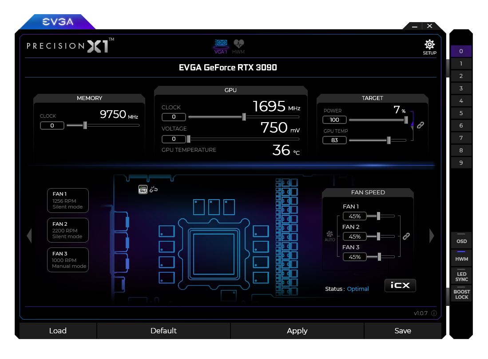
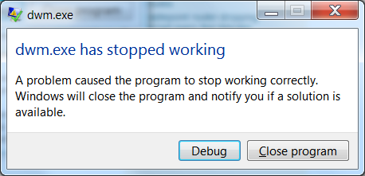
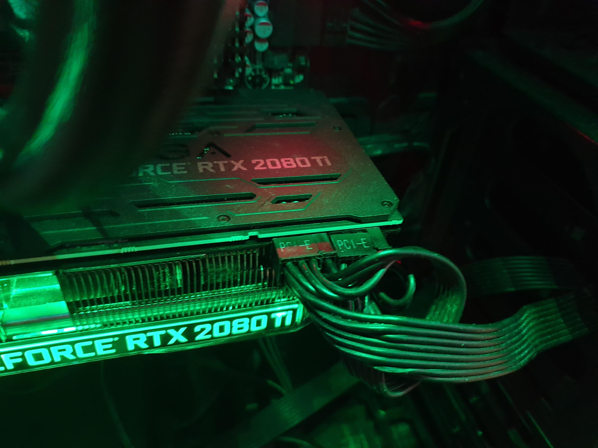

Hey there,

Today is about a topic that I spent the better half of my Saturday on, in order to fix my rig. I wanted to write it down, not just for my future self but also for others - I've seen hundreds of similar report in the usual hardware forums.

## Table of Contents
```toc
exclude: Table of Contents
```

## What's happening?

I was playing a game and suddenly out of nowhere: 
* Black Screen
* GPU fan get pretty loud (100% Fan Speed)
* Game continues in the background, evident by control input being honored and continued sound output
* Screen turns off for lost signal after some time and does not come back

No way to bring it back alive, hard restart needed.

## What can be the culprit?

There are plenty of things that can go wrong and in the worst case it is a combination of many. Below we will walk through a couple of these to rule them out as a potential source of issues.

* Power supply unit (PSU)
* GPU
* Drivers
* Mainboard
* Cosmic Rays

## Things to check on

Try to reproduce it reliably first, I used up a synthetic benchmark for that (3D Mark 4k TimeSpy) in stress mode and 20 loops. After 2-3 minutes of runtime it would turn off consistently. 

If you can't reproduce it might not actually be an issue of your hardware, maybe it was the game you are running. Try to find something that is in common: running with DX11? DX12? Finding a good reproduction is the first step in finding the root cause.

### GPU Temperature

The most common thing with GPUs blowing their fan at 100% and denying service would be temperature. If the card gets too hot, it will be loud due to the fan increasing speed and if that doesn't help it will just shut off. 

This is however very easy to figure out: install a monitoring app, ideally one that also logs to disk or opens a webserver (as we have a black screen and can't see it!). For me [Open Hardware Monitor](https://openhardwaremonitor.org/) is my tool of choice and has support for both. Flip the switch to 1s sensor logging intervals, run the benchmark and look at the numbers at the time of the crash. 

Nvidia cards usually turn off at around 97-100°C already, so if you're a good few degrees  away then it's not the issue. Otherwise, try to cool your card better and see if it fixes your problem. You can also try to reduce the voltage and clock of the GPU in order to make it cooler.

### GPU Voltage and Clock

Since the GPU turns off, it might also relate to the power it receives. I'm using a card from EVGA, so I used [EVGA Precision X1](https://www.evga.com/precisionx1/) to adjust the voltage. 



There is a "Power" target on the top right that you can increase, I tried to go at 10% increments all the way to 140% and it didn't fix the issue. 

Conversely you can also argue that clocking the GPU **down** will help to stabilize it. I tried to also clock it down all the way to half the original clock and at higher voltage - didn't fix it.

### PSU

Again, where does the voltage come from? The PSU! Unless your whole PC shuts down by full power loss, it is unlikely that this is broken completely. Maybe a single rail is broken?

Here are a couple things you can try:

* Check the cables, are they loose or dirty? Try to clean the pins on both ends with compressed air. Wiggle them and see if it reproduces it already.
* Use different rails for your GPU, maybe one rail is actually broken
* Try different cables and different rails
* Swap with another PSU you know works in some other rig

### Swapping cards

Ultimately, if another card works as a replacement then you at least know that the rest of the system works fine and you have a good reason to return your GPU. 

### Drivers

Especially when you have just recently installed a new version, the Nvidia driver is a hot candidate for causing such issues.

What would we see if the driver crashes though?

Normally this manifests itself as DVM crashing:



And after some time the screen appears again with a notification that the Nvidia driver has crashed.

When in doubt - driver sweeper. It's nowadays called [Display Driver Uninstaller (DDU)](https://www.guru3d.com/files-details/display-driver-uninstaller-download.html) and you still have to boot into safe-mode to get it to uninstall everything correctly. After a clean install and/or a rollback to a previous version you can see whether this has fixed your issue.

In my case that didn't happen and so the re-installation had no effect.

## The fix for me

It was a loose PSU cable on the GPU itself:



(no flex intended)

You can clearly see the right PCI-E connector that is hanging a bit off the slot. Turns out the cable is a bit old and I already ordered a couple new ones to replace it. Actually wiggling on the cable for a bit has revealed exactly the same symptoms that happen during gaming. 

Why does it happen only after some time? I assume that the slot gets warmer and a bit more elastic such that the cable does not sit tight anymore. Also interesting is the fact that a reboot brings back the display, that most likely means it cools down just enough to keep the contact.

I also remember when installing the card and it would not have enough voltage (one of the cables was actually broken), it would show no picture and just run at 100% fan speed.


Hope it helps to troubleshoot this!  
Thomas