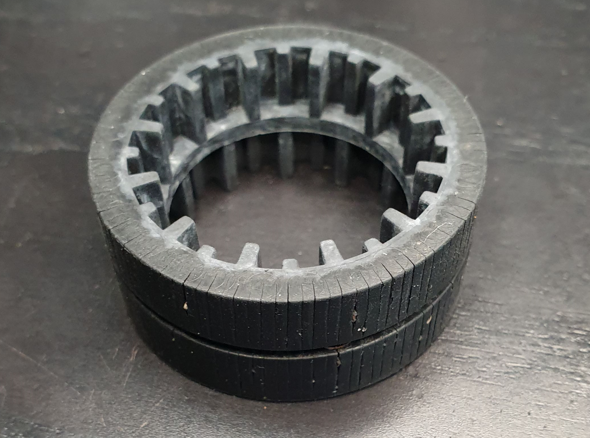
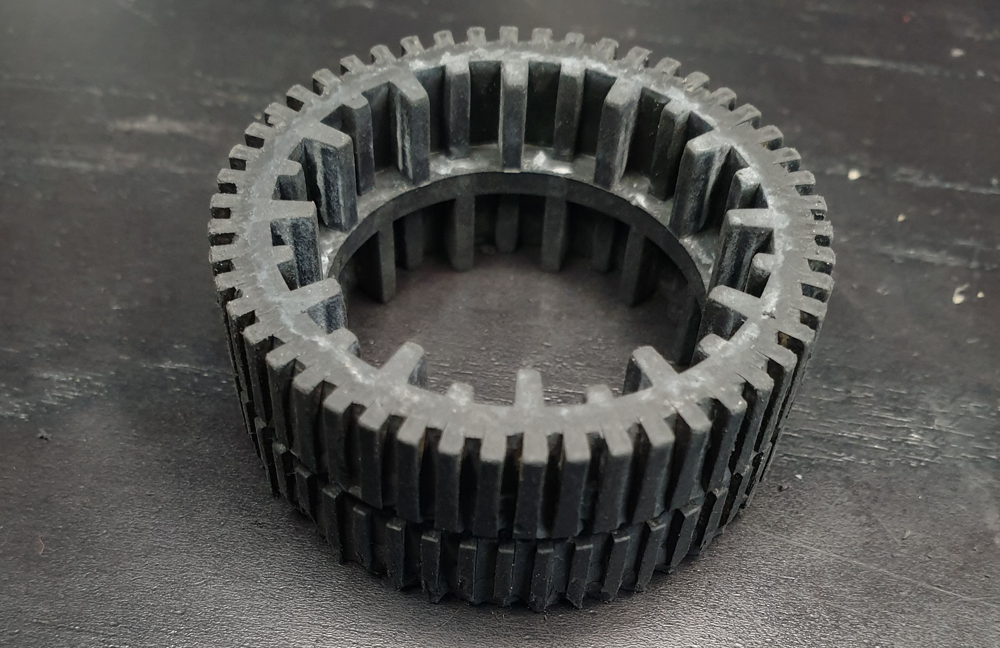

Since the last time I tried to fix the [Braava M6 to come out of its base station on its own again](https://blog.thomasjungblut.com/random/fixing-braava-m6/), I had a couple more encounters with Error 7 and 10. 

These error codes are officially described as "Wheel problem. See the app for help", one error for each of the wheels respectively. The official documentation will tell you to clean the wheels. 
For Roomba-experienced users, you'll find yourself screwing the wheels off and cleaning any debris and hair from the wheel bases. And for the most part it does work for a normal Roomba. 

Now even with wheel and base cleaned, my Braava continued to refuse its service with either of those errors, what to do? Similar to the issue in my previous blog post, this was caused by general issues of grip on the wheels. 
I found the rubber tyres to be in terrible shape after straight two years of usage and having virtually no grip on the floor anymore:

 

You can test this yourself by trying to push the wheel over your floor, if it just slides over it your tyres are done.
As you can also see there is lot of gross debris stuck on the inside and the color got much brighter. Check their elasticity too, mine were very solid and brittle.

How can we fix this? Let's take some inspiration from cars or bikes, what can you do to increase your grip on a tyre again? Obviously you could buy a new one: I contacted the iRobot support and they send them via mail in a couple of days. However, since mine are kinda done and the new ones are on the way, I've done a little experiment and tried to cutout a tyre tread pattern you would normally see in RC cars.

You can see on the picture above that there is already a little bit of tread, the individual pattern is very close together. This tread pattern didn't seem very efficient to me, after all the higher grip tyres you see on cars usually have larger holes on the tread to increase the surface and absorb water or other stuff on the road. Let's try this out here too:

 

It cost me two hours to cut the little rubber "pins" out of the wheel in an alternating pattern, you can take a Electronics Diagonal Cutter or any other plier that might cut through those little holes. Afterwards I took a Dremel to smoothen the edges off a bit and also roughen up the tread surface a little.

And it worked like a charm, it leaves the home base like never before and has no issues in moving around the house. 

Hope it helps!

Cheers,  
Thomas