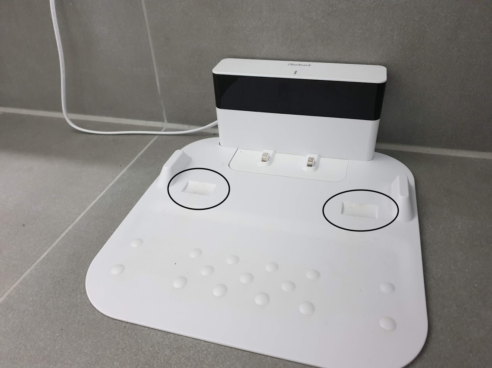
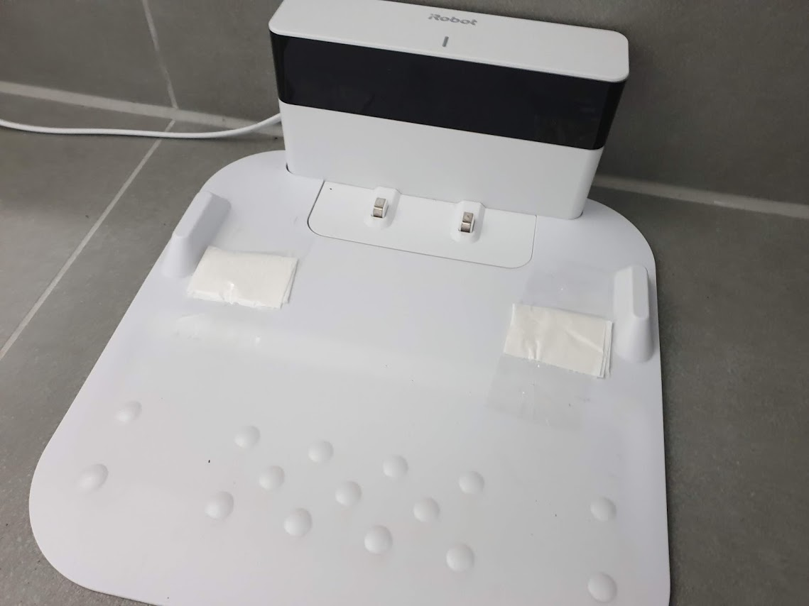

I got a Braava M6 a couple of months ago and I've been a happy customer so far. Most recently though, I encountered a rather annoying issue: **it's not leaving its home base anymore**. There is constant wheel-spin when it tries to leave the base and at some point it just becomes stuck and gives up the job. This is particularly annoying when you have it running on a schedule and you're away from home. 

Root Cause
==========

I couldn't really figure out what is wrong and it also doesn't happen in a reproducible manner. 

My assumption is that when it mops the floor, the wheels are becoming wet. This slight amount of water and slippery left-over from the cleaner is accumulating in the little wheel slots you see marked above. That then causes traction issues the next time it wants to leave the base.

The Fix
=======

Effectively this issue also goes away by constantly cleaning the base and so making sure that there is no residue of slippery stuff in there. But since I'm a super lazy person (I mean, that's why I bought it in the first place), I came up with this little fix:

Yes, toilet paper and transparent tape. It's simple: take a sheet of toilet paper, tear it in half, fold it and put tape over it.

Alternatively use a bit of cardboard, anything that keeps the hole level will work. Depending on the toilet paper you have at hand, this might also dent over time and you'll have the same issue once again.

It's fine when it actually creates a little bump, Braava will drive over it and still charge just fine:

Update: You might also want to checkout my new post on [modding the Braava tyres for even better grip](https://blog.thomasjungblut.com/random/fixing-braava-m6-wheel-mod/).

Hope it helps!

Cheers,  
Thomas