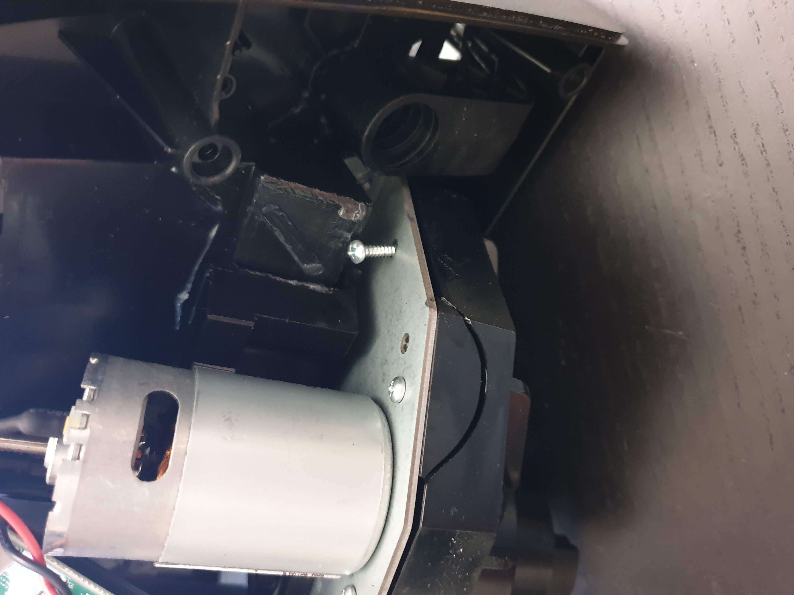

Hey there,

Today is about a topic that I spent the better half of my Saturday on, in order to fix my beloved Logitech G920.

## What's happening?

When you plug your G920 into your PC it will start calibrating: it goes 450° left, 450° right and then comes back into the middle. 
Today for the first time, it stops half-way through and suddenly flashes its white LED fast.

I tried to reinstall the drivers, plugin all cables in and out. Tried the same thing on my Xbox, the wheel can even be used as a controller. 
It exhibits the same problem of calibration.

## What can be the issue?

In several forums you'll find people with similar issues, the most common one seems to be the missing power plug. For that you need to know that it will flash the white LED the same way, but not very fast (once a second vs. every 200ms or so). 

If that doesn't fix it, I have bad news for you: you most likely have to tear it down.

## How to tear down?

Screw the wheel off first, there are the six lug nuts in the middle - screw them off. There are several small screws on the back too, once it comes off try to take the cable off carefully.

Next step is the wheel base mount, there you only have to unscrew the three long ones on the triangle. The others are for the paddles, which you don't need to remove.

Once you have the wheel base off as well, you can take the whole base and unscrew everything from the bottom. The case should open very easy after that, if not, you've probably missed a screw.

## What happened?

Apparently the force feedback was too hard at one point and the plastic mount of the servos just cracked:

As you can see there is this unhinged screw, which ended up in the rail of the steering axle. That prevented the wheel from calibrating and thus made it fail. 
I removed the screw, tried to duct tape the plastic together again and put everything together.

Needless to say, the wheel no initializes properly again.

Hope it helps!  
Thomas
