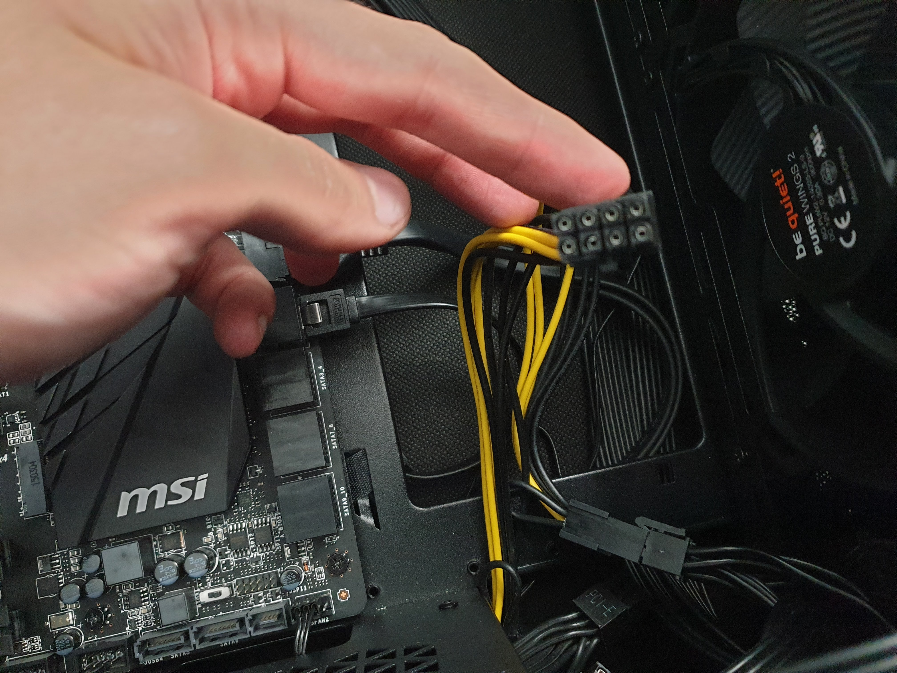
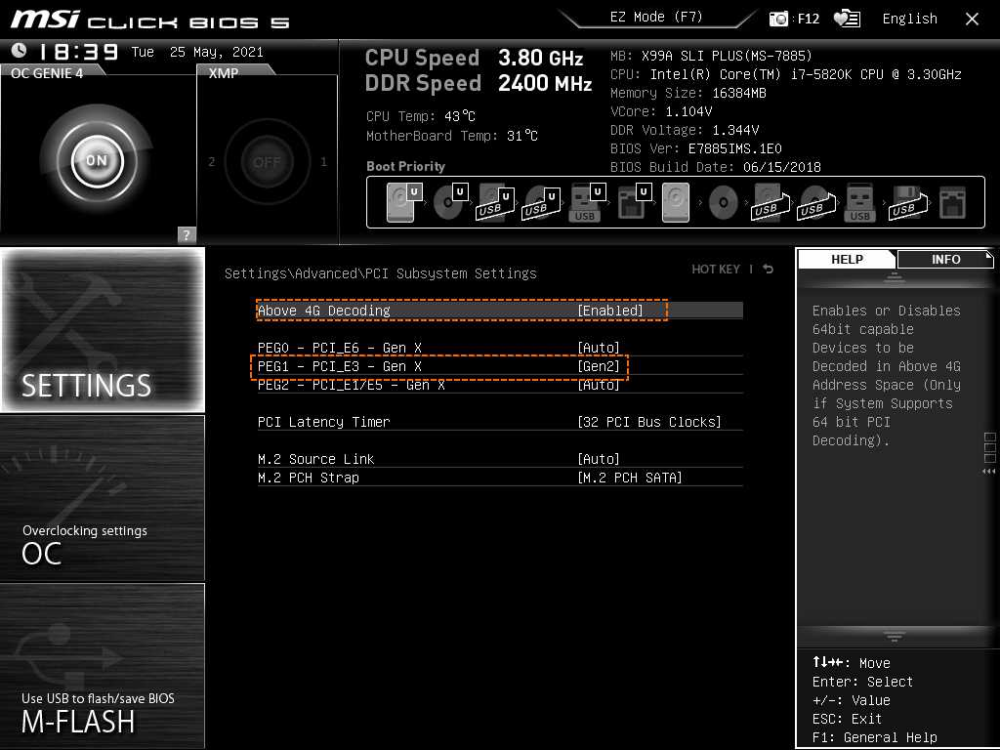
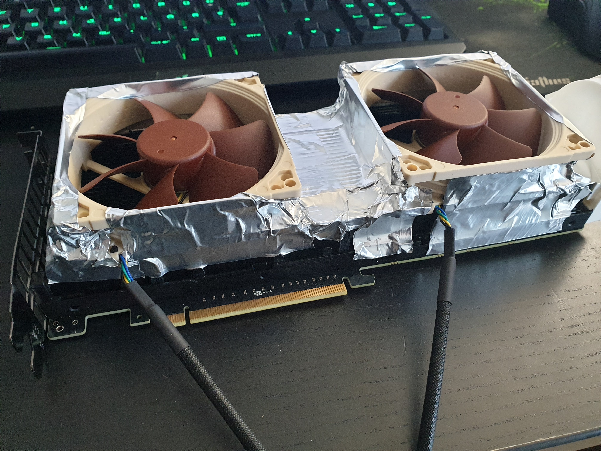
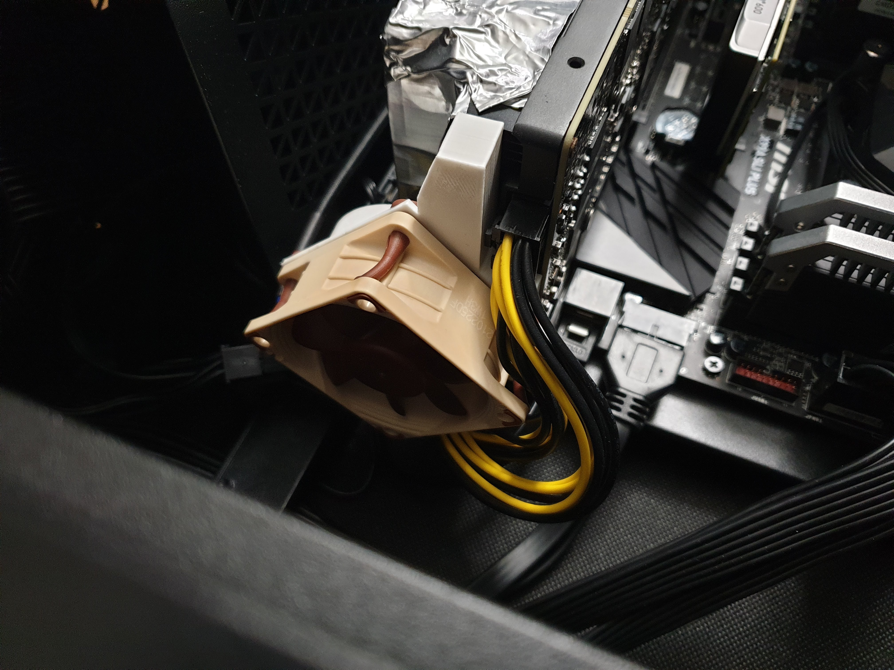
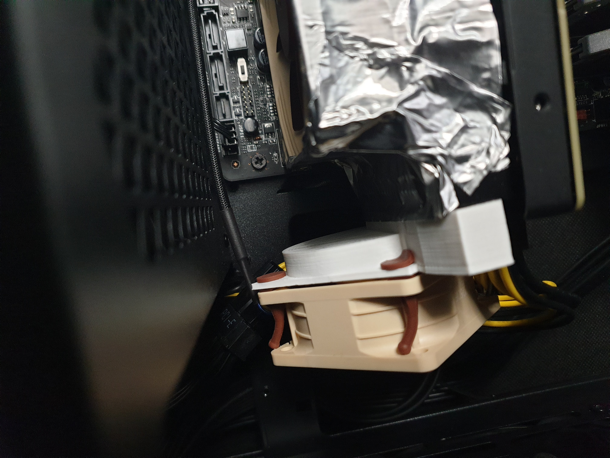

I was busy over the last couple months by not only rebuilding my gaming PC, but salvaging the old one into a new desktop server setup. 
What's usually missing in a great home server? Obviously a great GPGPU to do that sweet machine learning and crypto mining. 
I'm writing about some of the challenges I faced to get it running in a desktop case and how to overcome them.

## Table of Contents
```toc
exclude: Table of Contents
```

## What's a Nvidia Tesla K80?

The Tesla K80 is a server compute card (GPGPU) from Nov'2014. It's usually used in datacenters and server setups, most prominently featured in AWS where they are part of the p2 instance offering.

Why is it great? It actually has two GPUs (2× GK210) in a single card, each with a massive 12GB of VRAM - yes that's a whopping 24GB in total! 

What's even better? It's really cheap, you can get a [refurbished card for about 280€](https://www.ebay.de/itm/164862718429). That's really really cheap, for a card that used to cost several thousands just a couple years back. So I actually bought one, originally to do a bit of machine learning.

## How to run it?

Given it's a server card, it comes in that state:


The GPU experts among us will spot it: the fans are missing. This card is supposed to be cooled externally, basically via the airflow in a server rack like this and thus has no fan installed:


You can see the little and powerful fans in two rows at the bottom. Now obviously I don't really want to retrofit my old gaming desktop into a server rack due to the acoustics of such a rack setup, so can we make the Tesla K80 run in a plain desktop? 

### Power supply

The first challenge is to actually power the card with plain PCIe PSU cables. It's actually not possible, they won't fit even though you would think they do. In consumer gaming cards from Nvidia it's actually common to plug two 6-pin or 8-pin plugs into your card.

Back in 2014 Nvidia used, for the first time, a [8-pin CPU power connector instead of a 8-pin PCIe connector.](https://www.nvidia.com/content/dam/en-zz/Solutions/Data-Center/tesla-product-literature/Tesla-K80-BoardSpec-07317-001-v05.pdf) If your PSU has support for two CPU connectors, then you're good to go. My old consumer PSU from 2014 certainly didn't and I had to get a breakout cable that joins two 8-pin PCIe connectors into an 8-pin CPU connector. 



Apparently they were part of the original package, the refurbished card I got didn't come with it - yet you can still buy them ["NVIDIA dual 8 to 8 Graphics Card Power Cable Tesla K80 M40 Grid M60 P40 P100 GPU"](https://www.ebay.de/itm/193564253502) for example. It's also important to plug the two PCIe PSU cables into different power rails, keep in mind that each GPU will draw up to 150W - so 300W in total.

### BIOS Tweaks

Once powered, you most likely will run into compatibility issues with the BIOS. My X99 board complained about the PCIe power on the x16 lane ("System is running with Insufficient PCI Resources! PCI devices were set to disabled state! It is strongly recommended to Power Off the system and remove some PCI/PCI Express cards from the system!"), but turned out that this wasn't quite the issue. 

I had to enable the following two settings:



Namely the 4G decoding to support the 24GB of VRAM and the PCIe generation setting to Gen2. Then it would boot flawlessly into your favorite Linux distribution and would let you install the Nvidia drivers along with CUDA. On the CUDA note: the current driver generation (462.31) and CUDA release 11.2 will be the last to actually support the K80. 

### Cooling it

After booting it and installing the drivers, most likely it would already run into enough heating issue to turn itself off. 

First off, checkout the following video, I was mostly following the ideas in there - basically a fan + tons of aluminium tape:

`youtube: https://www.youtube.com/watch?v=I2zYOdfASFE`

Instead of the custom fan control and the industrial fan I used two Noctua NF-A9 92mm fans and a custom shroud that you can mount on the right side of the card:



The custom shroud and the Noctua NF-A6 60mm can be seen here in the already assembled state:





All fans blow, so the airflow comes from the front all the way into the back. I plugged all three fans into a single PWM using the merger cables coming with every Noctua fan and keep them running at 100%. They are extremely quiet, so I don't actually bother that much about getting the temperature control working.

You can find the shroud still on [Ebay](https://www.ebay.com/itm/124287700989). If you have a 3D printer at home it is actually simple to print yourself and I would certainly recommend doing this instead of paying the outrageous price plus shipping across the pond for that.

Alternatively checkout the stuff at [gpumods.com](https://gpumods.com/), which is having all that stuff already pre-manufactured and ready to buy so you just have to screw the fans in. 

## Can it mine Crypto?

Short answer: not anymore and certainly not profitably.

I did [benchmarks](https://github.com/ethereum-mining/ethminer/issues/472#issuecomment-833780809) with mining Ether, but at the time of writing and a 4.2GB DAG size and 4.29Gh difficulty it has a mere 4Mh/s. In comparison my 2080TI makes 50Mh/s, which generates roughly $6 per day at the current ETH price of $2k - not including the energy cost here!

Other coins that are supposed to work well with GPUs are similar in performance, so it's not really a viable mining card (anymore).

## How's the Machine Learning performance?

Since I bought it originally for machine learning, it's not any different than the K80s you get in the cloud.
I'm using the [PyTorch ImageNet example](https://github.com/pytorch/examples/tree/master/imagenet) and train it with [ImageNet subset data from Kaggle](https://www.kaggle.com/c/imagenet-object-localization-challenge/data?select=imagenet_object_localization_patched2019.tar.gz).

Effectively it's a single node and multi GPU training, so running this using [NCCL](https://developer.nvidia.com/nccl):

`python3 main.py -a resnet50 -b 220 --dist-url 'tcp://localhost:22222' --dist-backend 'nccl' --multiprocessing-distributed --world-size 1 --rank 0 ILSVRC/Data/CLS-LOC/`

I had to reduce the batch size from 256 to 220 to make it work with the amount of VRAM, but the batch time is around 2s when auto-boost kicks in - so that's 100 images/s which is still absolutely [competitive for training a resnet50 from scratch](https://www.leadergpu.com/tensorflow_resnet50_benchmark). 

## Undervolting

You can reduce the voltage of the card to save energy and reduce temperature. You can easily achieve this via nvidia-smi:

```
$ sudo nvidia-smi -i 0 -pl 125
Power limit for GPU 00000000:05:00.0 was set to 125.00 W from 149.00 W.
$ sudo nvidia-smi -i 1 -pl 125
Power limit for GPU 00000000:06:00.0 was set to 125.00 W from 149.00 W.
```

Here we reduced by 24W (-16%), from the default of 149W on both GPUs, the card will adjust its clocking and perf modes accordingly so there will be a performance loss. You have to experiment what works better for you in terms of temperature/energy efficiency and performance. I'm running mine on about 135W the whole time.

## Temperatures

IDLE at 30W I can report 30°C on both GPUs, with the one towards the back of the case to be 5-10% higher in temperature.

Mining crypto using ethminer can get up to 85°C, with the resnet50 training run above, I can get up to around 87°C in constant usage. I believe with industrial, or even just higher RPM fans, you can get it down to 60°C-70°C at the higher cost of acoustics.

Using the undervolting to 125W I can cap the heat to about 63°C constantly. At 100W it seems to cap out at 53°C at 10x the performance loss and my default of 135W goes closer towards 75°C with minor 1-5% loss of performance (measured by the resnet50 training).

## Closing Thoughts

The Tesla K80 is still a great card and a total bargain if you can get your hands on a refurbished version. At ~350€ (including fans and shrouds and cables) you get plenty of VRAM and good machine learning performance. 
