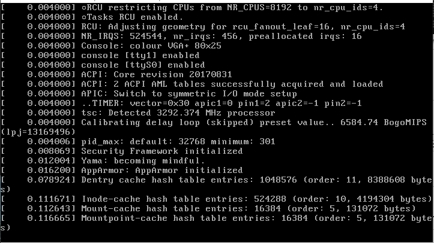

 I have been trying to get [Docker](docker.com), [VirtualBox](http://virtualbox.org/), [WSL 2](https://en.wikipedia.org/wiki/Windows_Subsystem_for_Linux#WSL_2) working at the same time with [Vagrant](https://www.vagrantup.com/). Working at the same time means that they run in parallel and work individually - so I'm not trying to run Docker on WSL2 to talk with something inside a VirtualBox spun-up by Vagrant.

The scenario is mostly around being able to use WSL2 and Docker on the Windows 10 host machine while you provision VMs (preferably with VirtualBox) provisioned via Vagrant.  
This issue took me a couple of hours to figure out and I wanted to share a bit of the steps and issues I've seen.

> TL;DR; there is no ultimate fix for this issue, but a workaround

The Setup
---------

I'm running on Win10, 19041 Build (May 2020 Update) and I have virtualization enabled in my BIOS. On top I'm running Docker (v19) with native WSL2 integration, coming from the Docker Desktop Application. The Docker Daemon is also exposed locally, so I can easily access it from my WSL2 running Ubuntu. All of these things run on top of, or through Hyper-V.

Hyper-V is installed and enabled at boot time - more on that later.

To make it more complicated I'm using Vagrant (2.2.10) and VirtualBox (6.1) to run some Ansible playbooks.

My VirtualBox VM does not boot...
---------------------------------

Testing some simple Vagrant box like that:

```vagrant
Vagrant.configure("2") do |config|
  config.vm.box = "ubuntu/bionic64"
end
```

**Will hang forever trying to create a VM in VirtualBox.**

Hold-on: we have Hyper-V installed, why isn't Vagrant picking that as the default provider? The image doesn't exist for Hyper-V and forcing it with `--provider hyperv` will tell you that it can only run with admin permissions. So it will fallback by default to `virtualbox` - **sigh**. 

Anyways, you will see a screen like this and without any particular error message in virtualbox and its system logs: 



Good luck searching the internet for that kind of issue. 

The Workaround
--------------

Everything hinges on a very small flag, take an elevated CMD or power shell and run:

```batch
bcdedit
```

Under "Windows Boot Loader" at the bottom, you should see this:

```batch
hypervisorlaunchtype    Auto
```

This is exactly what is [required to run Docker on Windows](https://docs.docker.com/docker-for-windows/troubleshoot/#virtualization). So it might actually come from the Docker installer, when you decided to install it after your VirtualBox.

To fix it, you simply have to turn it off:

```batch
bcdedit /set hypervisorlaunchtype off
```

and **reboot**. Now Vagrant and VirtualBox should work again. The WSL2 will also continue to work.

The big implication is that docker will stop working here though. It is quite vocal about it during startup and will link you to the above troubleshooting guide.

How do you reverse this again? Just set the same variable to `auto` and **reboot**:

```batch
bcdedit /set hypervisorlaunchtype auto
```

Same implications, but in reverse: VirtualBox can't run VMs anymore, but Docker will continue to work. The reboot makes it a bit hard to automate, but in theory you can wrap those in batch scripts.

Can't I just uninstall Hyper-V? 
-------------------------------

Yes you can, but it turns out that un-installation via Windows features will not eliminate the above boot flags. Especially if you still have WSL2 running, there are some left-overs that can't be disabled by any other means than `bcdedit`.

Hope it helped!

Cheers,
Thomas

